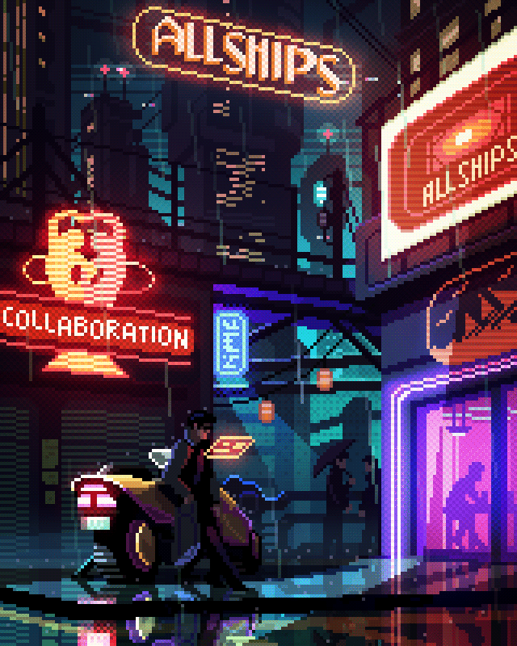

## Hi there 👋

  

<h3 align="center" style="color: #ff8c00;">Core Directives:</h3>

  <!-- Added &theme=dark so the icons fit the black background -->
  

  

  

<!-- Changed the color from blue to ff8c00 (neon orange) -->

  

